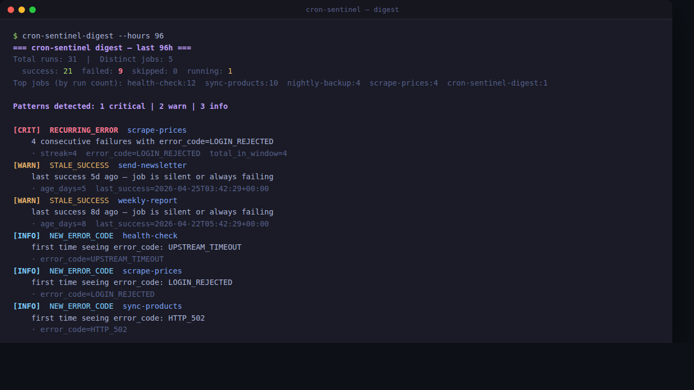

+++
title = "21 cron job al buio (e cosa ho fatto per accendere la luce)"
date = '2026-04-30T08:00:00+02:00'
draft = false
summary = "Ho 21 cron sul mio server. Per mesi non sapevo davvero quali girassero e quali no. Ho scritto un wrapper di 1.500 righe in Python — niente Prometheus, niente agent — e l'ho rilasciato open-source su GitHub."
tags = ["python", "devops", "cron", "open-source", "automazione", "self-hosted"]
categories = ["tech-tips"]

[cover]
  image = "list-runs.png"
  alt = "Output del comando cron-sentinel list-runs su terminale Tokyo Night, con 5 esecuzioni success seguite da 4 failed con error_code LOGIN_REJECTED"
  caption = "Ultime 12 esecuzioni di un job di scraping: 5 success, poi 4 fallimenti consecutivi con lo stesso error_code. Senza il wrapper non l'avrei saputo."
  relative = true
+++

Ho 21 cron job che girano ogni giorno sul mio server.

Backup, sync prodotti, scraping fornitori, report negozio, briefing del mattino. Cose che si occupano di pezzi della mia attività quotidiana mentre dormo o servo un cliente al banco.

Per mesi ho convissuto con un piccolo brivido: come faccio a sapere che girano davvero?

## Il sistema di "monitoraggio" che non era un sistema

Il mio sistema era leggere le email di errore. Quando arrivavano. **Se** arrivavano.

Spoiler: a volte un job falliva in silenzio per giorni. E me ne accorgevo solo perché un report arrivava vuoto, o un cliente chiedeva un dato che doveva esserci e non c'era.

Il caso peggiore: uno scraper di un fornitore aveva timeout per **quattro giorni di fila**. La password del portale era cambiata, il login restituiva un 401 strano, lo script catturava l'eccezione e usciva senza segnalare nulla. Quattro giorni di prezzi vecchi a listino. L'ho scoperto perché un articolo era venuto a costare meno della metà di quanto pensassi.

A quel punto ho deciso che bastava.

## Quello che NON volevo fare

L'opzione "ortodossa" sarebbe stata: Prometheus + Alertmanager + qualche exporter custom + Grafana per il dashboard.

Per **21 cron** sul mio piccolo server di negozio, è sproporzionato. È più infrastruttura del problema. E poi i tool di monitoring tradizionali non capiscono nativamente cose tipo:

- *"questo job è già girato oggi con successo, non rilanciarlo se per qualche motivo il cron riparte"*
- *"questo fallimento è dello stesso tipo di ieri e l'altroieri, non riprovarci a oltranza, dimmelo e basta"*
- *"questo run è identico a uno che ho già rifiutato per un motivo permanente — non lo eseguire neanche"*

Volevo qualcosa di più piccolo. E più consapevole del **contenuto** di un job, non solo del fatto che girasse o meno.

## La cosa che ho scritto

L'ho chiamata **cron-sentinel**. Tre pezzi, ~1.500 righe di Python, zero dipendenze (solo libreria standard):

- Un **runner** che metti *davanti* a ogni cron: avvolge il comando esistente, calcola un "bucket" temporale (giorno/ora/settimana), controlla se quella stessa identità è già andata a buon fine, e altrimenti esegue. Cattura stdout, stderr, exit code, durata in un envelope strutturato.
- Un **database SQLite** (un singolo file) che traccia ogni esecuzione: status, error_code, retryable o no, JSON completo dell'envelope per il debug.
- Un **digest** che gira la mattina alle 09:00, legge il database e mi dice se vede pattern interessanti.

Lo script del job sotto **non si tocca**. Cambio solo la riga del crontab.

## Il pezzo che mi piace di più

Non è il wrapper. È il contratto dell'envelope.

Ogni esecuzione finisce con un oggetto che dichiara non solo `ok / fail`, ma anche:

- l'`error_code` (un'etichetta semantica, non un exit code numerico)
- se l'errore è **retryable** o no

Questa singola informazione cambia tutto. Se un job fallisce per un motivo permanente — chiave API scaduta, file di config malformato, login rejected — il runner al tick successivo lo **salta**. Niente loop di errori che intasano i log e mandano notifiche a vuoto. Aspetta che io intervenga.

Se invece l'errore è transiente (timeout, 502, connessione resettata), al prossimo tick riprova. Comportamento giusto, automatico.

E se due esecuzioni dello stesso job partono in concorrenza — perché ho rilanciato manualmente mentre il cron stava già girando — la seconda si autospegne riconoscendo il "running" della prima.

## Il digest

Il pezzo che mi avrebbe fatto risparmiare quei quattro giorni di prezzi vecchi è il digest. Ogni mattina mi arriva su Telegram un report tipo questo:

Cinque pattern fissi che cerca:

| Codice | Cosa significa |
|---|---|
| `RECURRING_ERROR` | Stesso `error_code` ≥ 3 esecuzioni di fila, nessun success in mezzo |
| `NEVER_SUCCEEDED` | Job presente nella finestra, zero successi |
| `STALE_SUCCESS` | Ultimo success di questo job ≥ 3 giorni fa |
| `ELEVATED_FAIL_RATE` | Più del 50% di fallimenti nella finestra |
| `NEW_ERROR_CODE` | È apparso un `error_code` mai visto prima |

Non è osservabilità di livello enterprise. È il livello giusto **per la mia infrastruttura**: piccola, eterogenea, con pochi soldi e zero tempo.

## Perché lo metto online

Mi serviva. L'ho costruito per me. Ma il pattern — wrapper sottile, envelope strutturato, digest che cerca pattern invece di metriche — è abbastanza generico che potrebbe servire a chiunque gestisca una manciata di cron senza voler tirare in casa un osservatorio.

L'ho rilasciato MIT su GitHub: **[github.com/neosix78/cron-sentinel](https://github.com/neosix78/cron-sentinel)**.

Funziona con qualsiasi comando shell, non solo Python. Se anche tu hai più cron che voglia di guardarli, magari ti torna utile. E se non ti torna utile, almeno l'idea dell'envelope retryable/non-retryable è qualcosa che vale la pena rubare.
